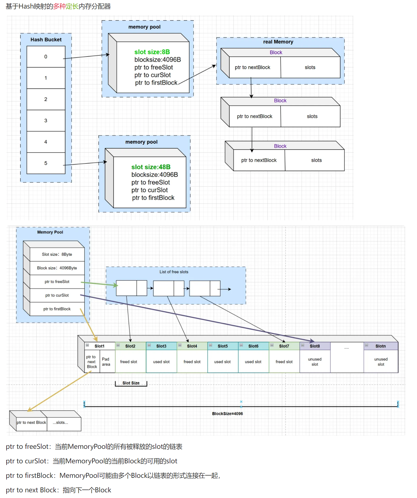
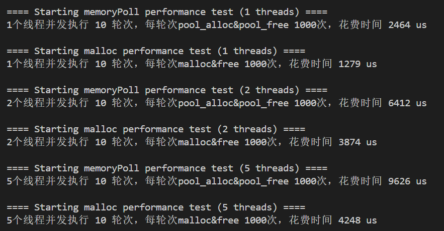

# c-meory-pool
原子操作用到了C11标准

## 项目介绍
只是为了学习，基于哈希映射的多种定长内存分配器，包含以下功能
- 内存分配：提供pool_alloc方法，从内存池中分配内存块
- 内存释放：提供pool_free方法，将内存块归还内存池
- 内存块管理：通过allocate_new_block方法管理内存块的分配和释放
- 自由链表：使用无锁/原子操作的free list管理空闲内存块

项目架构图如下


## 编译
生成debug版本
```
make DEBUG=1
```
生成普通版本
```
make
```
删除编译的中间文件以及可执行文件
```
make clean
```

## 运行
```
./可执行文件名
```

## 测试结果


通过测试结果可知性能还不如系统调用 malloc 和 free，因此需要后续的改进
